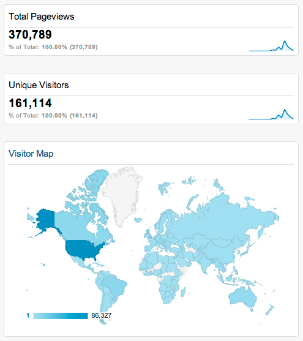
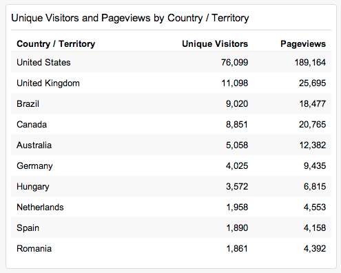
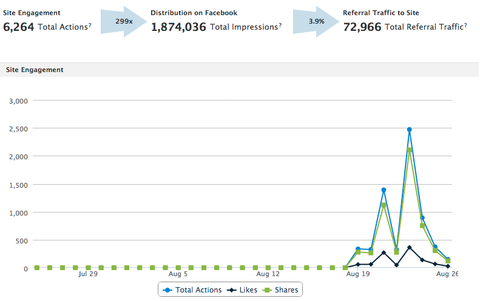
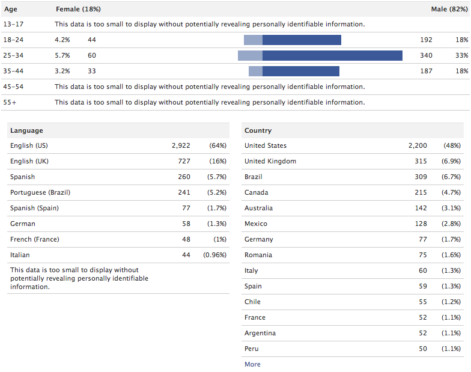
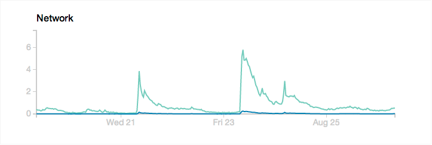
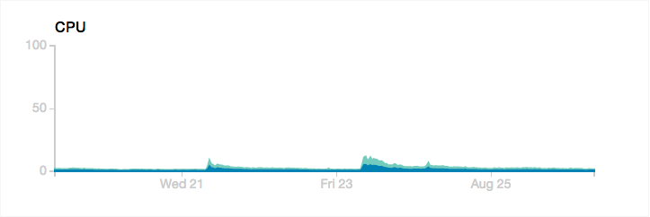

BibViz: Week One
================
BibViz launched exactly __one week ago__ and has been a huge success! I'd like to take this opportunity to write a little bit about the project and how it was able to grow to __hundreds of thousands__ of views so quickly, as well as to thank everyone who participated by blogging about the project, sharing with their friends on social networks, or just visiting and exploring the site.

Who, What and Why
-----------------
The idea for BibViz formed in early August 2013 while browsing around for the [Reason Project's biblical contradictions poster](http://www.project-reason.org/gallery3/image/105/) after a heated religious debate about biblical literalism and public policy / school programs. I was able to find it, but once again saw that it hadn't been updated to remove duplicate entries and was difficult to navigate or do much with. When a friend suggested that I could do better the thought nagged at the back of my mind for the next few days.

I did some research and found the excellent [Skeptic's Annotated Bible](http://www.skepticsannotatedbible.com) website by Steve Wells, who deserves all credit for crawling through the Bible and finding the various contradictions, violent passages and more. Using his website as a resource I was able to data mine the information with a few quick [Node.js](http://nodejs.org/) scripts and massage the data into a usable format for myself. Then I was able to create a quick basic website and generate charts using [D3.js](http://d3js.org/), an open source data visualization library with support for interactive elements through SVG and Javascript.

From start to finish it took about a week to get a decent looking site, with some final touches for social media markup and a few minor fixes after launch. This included research time, time learning some Node.js libraries, time learning D3.js, etc. Today I continue to work on the site, adding features and fixing issues that people find and bring to my attention. I'm working on adding more content (like this blog) and setting up a framework for translations into various languages through static site generators.

Some people have asked why I wasted time creating such a site. I believe that __there is value in having useful resources for people to easily explore and learn__. Given that 46% of Americans believe in a literal interpretation of a creation myth and other stories in a very old book with such a colorful past it seems worthwhile to provide a resource for exploring the issues with taking that book literally. These 46% of Americans are voting in elections, making choices in their communities and driving grassroots campaigns around the nation based on their arguably false beliefs. I believe that education is the answer, and I hope that this project helps toward that goal.

Many other people have asked about my own personal beliefs, but I want to reiterate that what I believe does not matter. Take a look at the evidence, think for yourself, and come to your own conclusions.

Coverage
--------
The project has gotten a lot of great coverage from many sources, but I'd like to highlight a few of the larger ones here.

Before I had even __publicly announced the site__, but after reaching out to Steve Wells, Hemant Mehta of Friendly Atheist emailed me asking about the project - apparently one of his readers had found the site. Hemant had this to say on [his blog](http://www.patheos.com/blogs/friendlyatheist/2013/08/19/an-incredible-interactive-chart-of-biblical-contradictions/) the next day:

> Now, computer programmer Daniel G. Taylor has taken all that data and turned it into a visual masterpiece...
>
> The whole site is seriously an incredible resource. Go there and just play around with it.
> 
<a href="http://www.patheos.com/blogs/friendlyatheist/2013/08/19/an-incredible-interactive-chart-of-biblical-contradictions/">Hemant Mehta, Friendly Atheist</a>

After this post was a big surge of traffic from Facebook, but due to the nature of sharing only with friends I'm not able to easily find who shared what there. To my anonymous supporters I say thanks.

Next it was picked up as [#80 for August on Quipsologies](http://www.underconsideration.com/quipsologies/archives/august_2013/arminvit_80.php), and from there it hit Gizmodo in [English](http://gizmodo.com/this-comprehensive-map-traces-463-of-the-bibles-major-1188177994) and Spanish.

> Now, one designer has built a handy map to help us navigate the text.
>
> Using data from the Skeptic's Annotated Bible, programmer Daniel G. Taylor created this encyclopedic visualization of 463 of the Bible's major contradictions.
> 
<a href="http://gizmodo.com/this-comprehensive-map-traces-463-of-the-bibles-major-1188177994">Gizmodo</a>

It also hit [Misterios Domundo](http://misteriosdomundo.com/este-mapa-revela-463-contradicoes-da-biblia) and with it a slew of Spanish-language tweets flew by.

> Usando dados do próprio livro, o programador e designer Daniel G. Taylor criou este site que contem 463 das principais contradições da Bíblia.
> 
<a href="">Misterios Domundo</a>

[Slate](https://twitter.com/Slate/status/371064266880978945) also released a brief tweet about the site, causing a  spike in traffic:

> Charting the Bible's contradictions: http://slate.me/154lv1M
> 
<a href="https://twitter.com/Slate/status/371064266880978945">Slate (via Twitter)</a>

Aside from the larger sources above many, many smaller sources shared the site as well, and tweets have been flying in at least half a dozen languages around the clock.

Statistics
----------
In the past week, BibViz has gotten over __370,000 page views__ from over __160,000 unique visitors__. These visitors came from __over 190 different countries__ in the world, from all kinds of ages and backgrounds. The vast majority of traffic came from the __United States__ with the __UK__ in second. Brazil, Canada, Austria, Hungary, the Netherlands, Spain and Romania also had a good number of visitors.

I'm not sure if this qualifies as "going viral" but I have to say I'm struck with awe at how popular BibViz has become in so little time.

Facebook provides a nifty tool they call [Insights](http://www.facebook.com/insights) to let the owner of a website track anonymous shares, likes and demographics. BibViz had __over 6,250 likes and shares__ which in turn meant almost __two million impressions__ on people's walls. Interestingly, most sharing was performed by men by a wide margin. BibViz was shared in posts using __six different languages__.

As for the server hosting the website, it is hosted by [Digital Ocean](https://www.digitalocean.com/?refcode=1da202e90785) and held up fantastically. I don't want this to turn into a review or ad for their service, but I will say that my entire experience so far with Digital Ocean has been wonderful. Signing up was painless (use _OMGSSD10_ for $10 free credit) and I had a virtual server up and running in minutes. Then it was just a matter of setting up DNS to point to the server, setting up Nginx and we're ready to rock.

The service saw short-term (5-minute average) spikes of __over 10 Mbps__ network traffic and around __20% CPU__ use with around __100 requests per second__. Here are the 30-minute averages for the week for network and CPU use (disk usage was so low that the graph showed almost nothing):

_Note_: these graphs are for the __lowest tier virtual server__!

As for donations and referal sales, I have gotten a small number of each. Very few people seem to have clicked the donate button (bottom right of this page), but I am eternally thankful to those that have. Your donations will help to cover server costs and future development of this website.

Thanks
------
I want to take this opportunity to thank everyone that shared and visited BibViz over the past week again. You have made this project come alive.

Let's see what we can do in the coming months!
